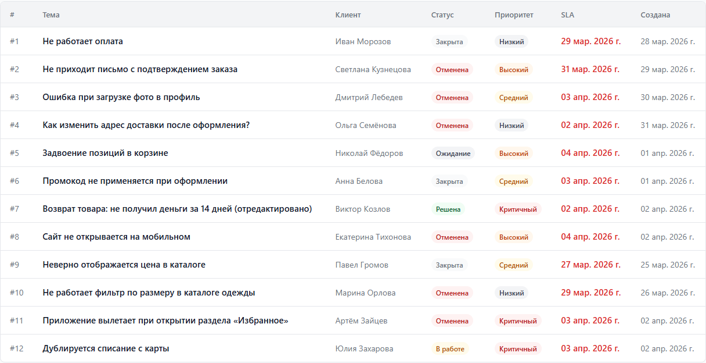
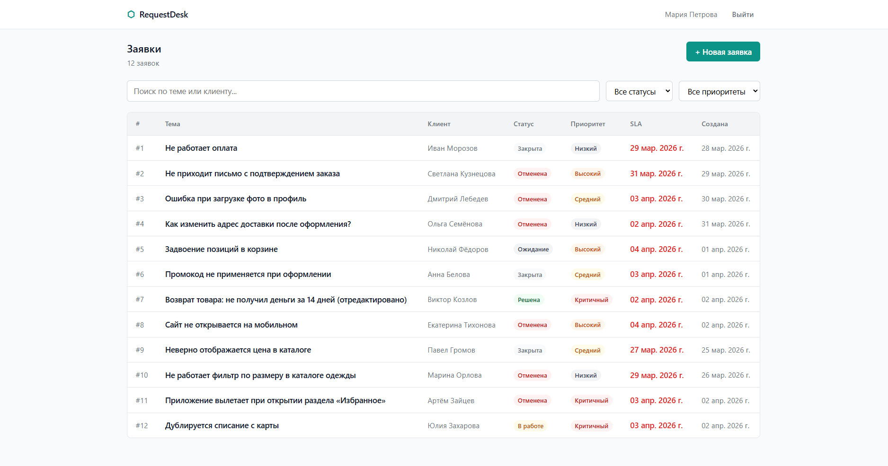

# RequestDesk

Веб-приложение для управления заявками технической поддержки. Менеджеры принимают заявки от клиентов, отслеживают статусы, соблюдают SLA-дедлайны и общаются через комментарии.



---

## Стек технологий

- **React 19** + **TypeScript**
- **Vite 8** — сборка
- **React Router v7** — маршрутизация
- **React Context** — состояние авторизации
- **CSS Modules** — стилизация
- **json-server** — mock REST API
- **clsx** — условные классы

---

## Запуск проекта

### Требования

- Node.js 18+

### Установка

```bash
git clone https://github.com/Kato-svg/Request-desk.git
cd Request-desk
npm install
```

### Запуск

Открой **два терминала** и запусти поочерёдно:

```bash
# Терминал 1 — mock API
npm run api
```

```bash
# Терминал 2 — приложение
npm run dev
```

- Приложение: `http://localhost:5173`
- API: `http://localhost:3001`

### Тестовый аккаунт

- Email: maria@requestdesk.ru
- Пароль: password123

---

## Возможности

- Авторизация с inline-валидацией и защищёнными маршрутами
- Список заявок с фильтрацией по статусу и приоритету, поиск по теме и клиенту
- Skeleton-загрузка, empty state и error state на всех страницах
- Детальная страница заявки — описание, смена статуса, комментарии
- Создание и редактирование заявок с валидацией полей
- SLA-дедлайн с подсветкой просроченных заявок
- Адаптивная вёрстка — работает на мобильных от 375px

---

## Скриншоты

| Вход                                | Список заявок                                               |
| ----------------------------------- | ----------------------------------------------------------- |
|  |  |

| Детальная страница                                        | Создание заявки                                        |
| --------------------------------------------------------- | ------------------------------------------------------ |
|  |  |

---

## Маршруты

| Путь                | Страница           |
| ------------------- | ------------------ |
| `/login`            | Авторизация        |
| `/tickets`          | Список заявок      |
| `/tickets/new`      | Новая заявка       |
| `/tickets/:id`      | Детальная страница |
| `/tickets/:id/edit` | Редактирование     |

---

## Статусы и переходы

| Статус   | Доступные переходы |
| -------- | ------------------ |
| Новая    | В работе, Отменена |
| В работе | Ожидание, Решена   |
| Ожидание | В работе, Отменена |
| Решена   | Закрыта, В работе  |
| Закрыта  | —                  |
| Отменена | —                  |

---

## Структура проекта

src/
├── api/ # fetch-функции (tickets, comments)
├── components/
│ ├── ui/ # Button, Badge, Input, Spinner, TableSkeleton
│ ├── tickets/ # TicketFilters, TicketForm, StatusActions
│ └── layout/ # AppLayout, AppHeader
├── context/ # AuthContext
├── hooks/ # useTickets, useTicketDetail, useTicketFilters
├── pages/ # LoginPage, TicketsPage, TicketDetailPage, ...
├── types/ # TypeScript типы
└── utils/ # formatDate, filterTickets
