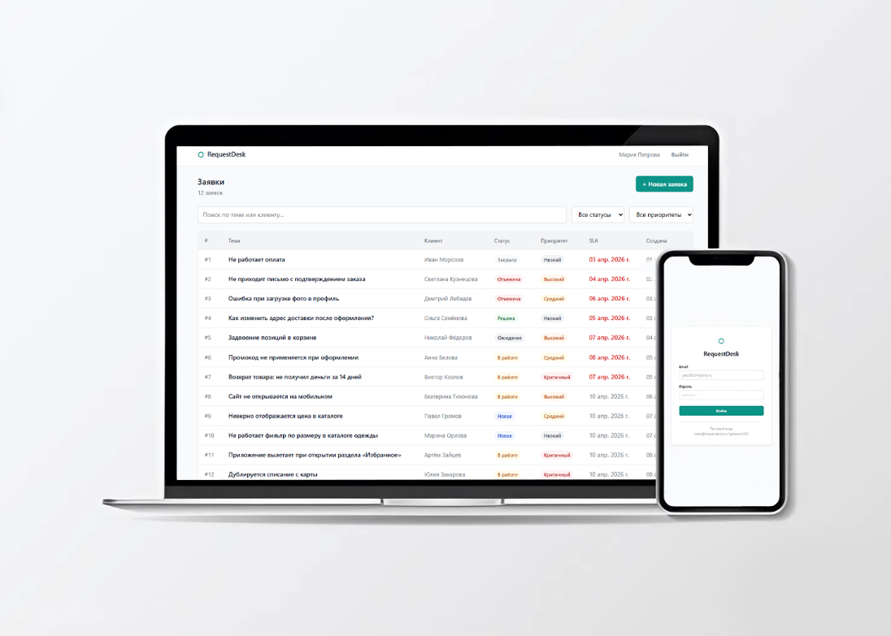
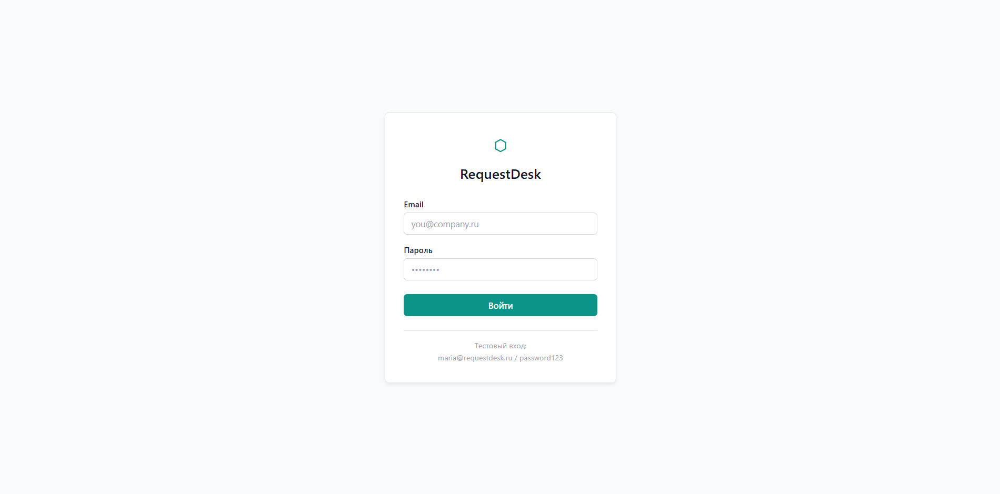
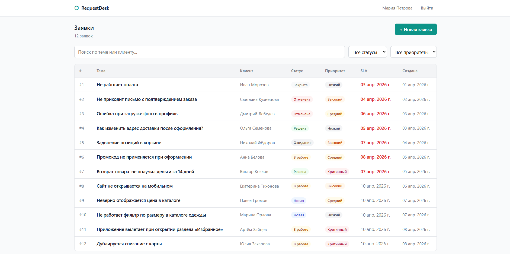
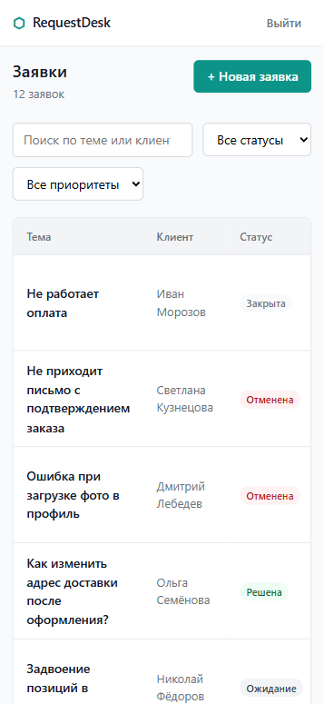
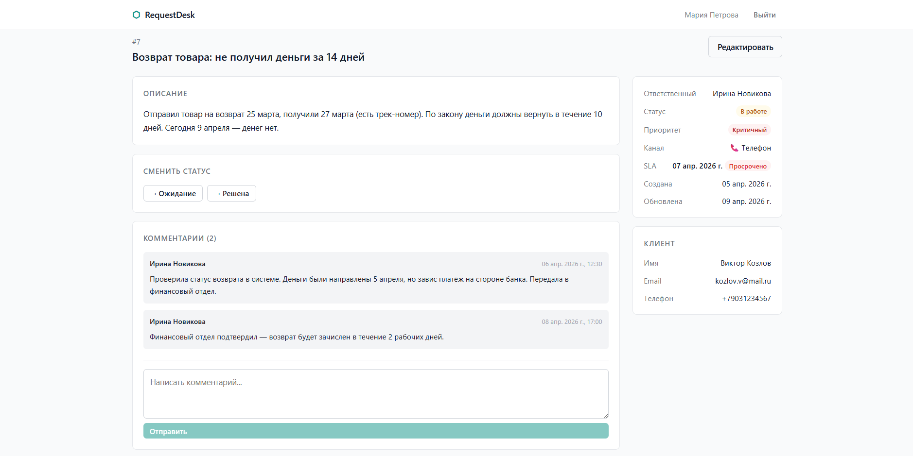
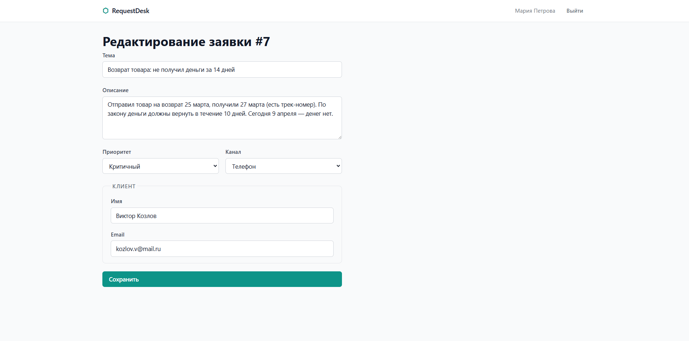
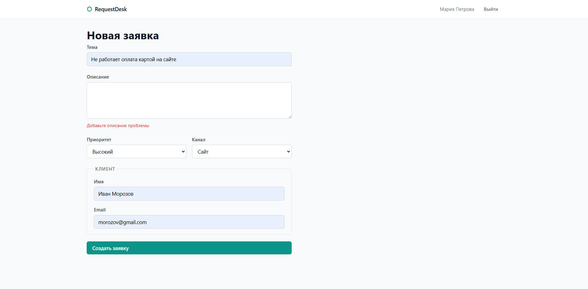

# 🗂️ RequestDesk

Веб-приложение для управления заявками технической поддержки.  
Менеджеры принимают заявки от клиентов, отслеживают статусы, соблюдают SLA-дедлайны и общаются через комментарии.



---

## Стек технологий


- **React** + **TypeScript**
- **Vite** — сборка
- **React Router** — маршрутизация
- **React Context** — состояние авторизации
- **CSS Modules** — стилизация
- **json-server** — mock REST API
- **clsx** — условные классы

---

## 📸 Скриншоты

| Авторизация                                | Список заявок — Desktop                                          |
| ------------------------------------------ | ---------------------------------------------------------------- |
|  |  |

| Список заявок — Mobile                                 | Детальная страница заявки — Desktop                              |
| ------------------------------------------------------ | ---------------------------------------------------------------- |
|  |  |

| Детальная страница заявки — Mobile                            | Детальная страница заявки — Mobile                                        |
| ------------------------------------------------------------- | ------------------------------------------------------------------------- |
|  |  |

| Редактирование заявки                                      | Создание новой заявки                                     |
| ---------------------------------------------------------- | --------------------------------------------------------- |
|  |  |

---

### Авторизация

> Форма входа с inline-валидацией полей и отображением тестовых credentials. Демонстрирует: работу с формами, защищённые маршруты (React Router), управление состоянием авторизации через Context API.

---

### Список заявок — Desktop

> Полный список тикетов с фильтрацией по статусу и приоритету, поиском по теме и клиенту, подсветкой просроченных SLA. Демонстрирует: работу с REST API, кастомные хуки, фильтрацию данных на клиенте.

---

### Список заявок — Mobile

> Адаптивная версия списка заявок от 375px. Демонстрирует: mobile-first подход, CSS Modules, адаптивные таблицы.

---

### Детальная страница заявки — Desktop

> Полная информация о тикете: описание, данные клиента, смена статуса, SLA-дедлайн, блок комментариев. Демонстрирует: динамическую маршрутизацию, конечный автомат статусов, работу с вложенными данными.

---

### Детальная страница заявки — Mobile (часть 1 и 2)

> Полная прокручиваемая страница тикета на мобильном устройстве. Демонстрирует: адаптивный layout, грамотную расстановку элементов при ограниченной ширине экрана.

---

### Редактирование заявки

> Форма редактирования с предзаполненными полями и валидацией. Демонстрирует: управление состоянием формы, переиспользование компонентов (один компонент для создания и редактирования).

---

### Создание новой заявки

> Форма создания тикета с валидацией обязательных полей, выбором приоритета и канала, блоком данных клиента. Демонстрирует: controlled-компоненты, inline-валидацию, POST-запросы к API.

---

## 🚀 Функциональность

- **Авторизация** — вход по email/паролю, защищённые маршруты, сохранение сессии
- **Список заявок** — фильтрация по статусу и приоритету, поиск по теме и имени клиента
- **SLA-дедлайны** — визуальная подсветка просроченных и горящих заявок
- **Детальная страница** — описание, смена статуса через конечный автомат, комментарии
- **Создание заявки** — форма с валидацией полей, выбор приоритета и канала обращения
- **Редактирование заявки** — изменение любых полей с повторной валидацией
- **Skeleton-загрузка** — скелетоны вместо спиннеров на всех страницах
- **Empty state и Error state** — обработка пустых данных и ошибок сети
- **Адаптивная вёрстка** — корректное отображение на экранах от 375px

---

## 🛠 Стек технологий

| Технология            | Версия | Зачем используется                         |
| --------------------- | ------ | ------------------------------------------ |
| **React**             | 19     | UI-библиотека, компонентный подход         |
| **TypeScript**        | 5.x    | Строгая типизация, надёжность кода         |
| **Vite**              | 8      | Быстрая сборка и HMR в разработке          |
| **React Router**      | v7     | Клиентская маршрутизация, защищённые роуты |
| **React Context**     | —      | Глобальное состояние авторизации           |
| **CSS Modules**       | —      | Изолированные стили без конфликтов классов |
| **json-server**       | 1.x    | Mock REST API для имитации бэкенда         |
| **ESLint + Prettier** | —      | Единый стиль кода, предотвращение ошибок   |
| **clsx**              | —      | Условное применение CSS-классов            |

---

## ⚙️ Локальный запуск

### Требования

- Node.js **18+**
- npm **9+**

### Установка

```bash
git clone https://github.com/Kato-svg/Request-desk.git
cd Request-desk
npm install
```

### Запуск

Открой **два терминала** и выполни команды поочерёдно:

```bash
# Терминал 1 — Mock API (запускать первым)
npm run api
```

```bash
# Терминал 2 — Приложение
npm run dev
```

- Приложение: [http://localhost:5173](http://localhost:5173)
- API: [http://localhost:3001](http://localhost:3001)

### Тестовый аккаунт

- Email: maria@requestdesk.ru
- Пароль: password123

---

## 📁 Структура проекта

src/
├── api/ # Fetch-функции для работы с tickets и comments
├── components/
│ ├── ui/ # Переиспользуемые компоненты: Button, Badge, Input, Spinner, TableSkeleton
│ ├── tickets/ # Бизнес-компоненты: TicketFilters, TicketForm, StatusActions
│ └── layout/ # AppLayout, AppHeader
├── context/ # AuthContext — состояние авторизации
├── hooks/ # useTickets, useTicketDetail, useTicketFilters
├── pages/ # LoginPage, TicketsPage, TicketDetailPage, NewTicketPage, EditTicketPage
├── types/ # TypeScript-интерфейсы и типы
└── utils/ # Вспомогательные функции: formatDate, filterTickets

---

## Статусы и переходы

| Статус   | Доступные переходы |
| -------- | ------------------ |
| Новая    | В работе, Отменена |
| В работе | Ожидание, Решена   |
| Ожидание | В работе, Отменена |
| Решена   | Закрыта, В работе  |
| Закрыта  | —                  |
| Отменена | —                  |

---

## 🎯 Цель проекта

RequestDesk — учебный проект, созданный для отработки ключевых навыков frontend-разработки в контексте реального бизнес-приложения. Основные задачи: построить SPA с клиентской маршрутизацией и защищёнными роутами, отработать взаимодействие с REST API через кастомные хуки, реализовать сложную доменную логику (конечный автомат статусов, SLA) и добиться качественной адаптивной вёрстки без UI-фреймворков.

---

## 🔮 Планы по развитию

- [ ] Деплой фронтенда на **Vercel** + перевод API на **Railway** или **MockAPI.io**
- [ ] Добавить **роли пользователей**: менеджер и администратор с разными правами
- [ ] Реализовать **пагинацию** или бесконечный скролл для списка заявок
- [ ] Написать **unit-тесты** для хуков и утилит (Vitest + React Testing Library)
- [ ] Добавить **тёмную тему** через CSS-переменные

---

## 👤 Автор

**Biruzov M.R**  
[GitHub](https://github.com/Kato-svg)
